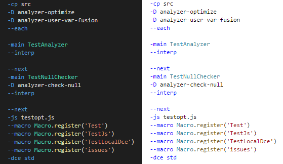

# haxe-TmLanguage

[](https://travis-ci.org/vshaxe/haxe-TmLanguage)

This repository contains the `.tmLanguage` grammar files for `.hx` and `.hxml` used for syntax highlighting by the [Visual Studio Code extension](https://github.com/vshaxe/vshaxe).

## Haxe example


## HXML example



## Conversion

The `tmLanguage` XML files are converted from their `YAML-tmLanguage` source files:

```
haxelib install yaml
haxelib git plist https://github.com/back2dos/plisthaxelib
haxe convert.hxml
neko bin/convert.n
```

## Tests

There are some automated tests that can be run like this:

```
haxelib install hxnodejs
npm install vscode-textmate
haxe test.hxml
node bin/build.js
node bin/test.js
```

`/cases` contains the actual test cases. When running `build.js`, scope-annotated files are generated into the `/generated` directory. During the test step (running `test.js`), the files in `/baselines` are compared with the newly `/generated` ones, and the test fails if they are different.

So when adding a new test, follow these steps:

- create a new test case in `/cases`
- verify that the highlighting is ok
- run `build.js` and copy the file in `/generated` into `/baselines`

____________

Note: you can just run `haxe all.hxml`, which does the conversion and then runs the tests. If you have this project open in VSCode, you can just execute the build task (<kbd>Ctrl</kbd>+<kbd>Shift</kbd>+<kbd>B</kbd>) to execute `all.hxml`.